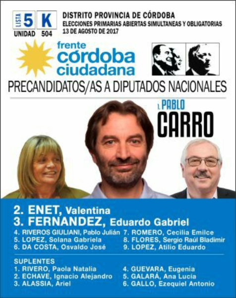

title: Capacitacion Fiscales Córdoba

background-image: url(img/cfk-carro-s.png)

# Frente Córdoba Ciudadana

## Elecciones 2017

---

# Elecciones Primarias

.side-image[]

Este será el voto:

---

# ¿Qué se elige?

- 127 Diputados (renueva media cámara) y
- 24 Senadores Nacionales (renueva un tercio de la cámara).
- Córdoba renueva  9 diputados (no renueva senadores)

---

## ¿Quiénes pueden Votar?

- Argentino nativos y por opción.
- Mayores de 16 años.
- Opcional para menores de 18 años y mayores de 85 años.

???
Los argentinos nativos y por opción, desde los dieciséis (16) años de edad (que cumplan 16 años hasta el día de las elecciones generales), y que figuren en padrones.
El sufragio es obligatorio a partir de los 18 años de edad. Para las personas de 16 y 17 años es opcional.

---
## Cual es el resultado?

- Determinar las agrupaciones que intervienen en las elecciones de Octubre.
- Elegir los candidates que compiten en internas de cada agrupacion.
- Es necesario superar un mínimo del 1,5% de los votos valdos.

???
Como resultado de las PRIMARIAS, cada agrupación política podrá intervenir en la elección en octubre postulando a quienes hayan resultado electos, siempre que haya obtenido como mínimo el 1,5% de los votos válidos a nivel nacional.

---
class: impact 

## Elecciones Primarias
# 13 de Agosto

---

## Documentación habilitante para votar:

- DNI tipo libreta.
- Libreta Cívica (LC)
- Libreta de Enrolamiento(LE)
- **Todos** DNI Tarjeta

???
Documento Nacional de Identidad, en cualquiera de sus formatos (DNI tapa verde o celeste)
Libreta Cívica (LC)
Libreta de Enrolamiento(LE)
TODOS los D.N.I formato tarjeta (incluso los que tienen la leyenda "no válido para votar")

---
class: impact

# Fiscales

---

layout: true

# Fiscales
 
---

- Son representantes de las **agrupaciones politicas**
- No son autoridades de mesa.
- Velan por el buen desarrollo de la eleccion.

???
NO SON AUTORIDADES DE MESA, son representantes de las agrupaciones políticas que velan por el buen desarrollo de la elección en general y por los intereses partidarios en particular, dentro de los límites que el Código Electoral Nacional les acuerda.

---

## Misión

- Verificar las disposiciones.
- Reportar incumplimientos.
- Dejar constancias.

???
La mision como fiscal es la de controlar y la de verificar, durante todo el transcurso del acto eleccionario, si las disposiciones legales que lo rigen se cumplen en su integridad. 

En el supuesto de un presunto incumplimiento, debe hacer la propuesta correspondiente ante el Presidente de la Mesa dejando constancia de las anomalías que creyere se hubieran cometido o se estén llevando a cabo.

---

## Requisitos

- Saber leer y escribir.
- Ser elector en el distrito en donde actua.
- Presentar el poder que lo habilita.

???
Deberá saber leer y escribir y ser elector del distrito en que pretenda actuar.

Los fiscales partidarios sólo podrán votar en la mesa en la que se encuentren inscriptos según el padrón electoral: NO PUEDEN agregarse en la mesa en la que fiscalizan, (Art. 11 de la Ley 26.744 sancionada el 16/05/2012, que deroga esta potestad que SI tenían para los comicios anteriores)

Deben presentarse ante la Autoridad de la Mesa con el poder que los acredita como tales: llevará el nombre y apellido completos, documento cívico (LE, LC o DNI) y firma del Fiscal al pie, junto a la de la autoridad partidaria que lo otorgue. Los poderes de los Fiscales de Mesa serán retenidos por el Presidente.

---

## Atribuciones

- Entrar y salir de la Escuela.
- Pedir examinar el cuarto oscuro.
- Entregar las **boletas**. 
- Estar **presentes**.

???
Entrar y salir libremente del edificio y pedir al Presidente de Mesa que examine el cuarto oscuro cuantas veces consideren necesario
Entregar las boletas de su partido a las Autoridades de Mesa para su colocación en el cuarto oscuro y para su eventual reposición.
Estar presentes cuando el Presidente cierre y tape las ventanas y puertas del recinto que habilitará como cuarto oscuro.

---

## Atribuciones

Firmar :
- El Padrón de Consulta de los Electores
- La Faja de Seguridad de la Urna
- Las Actas de Apertura y Clausura de Comicios
- Los Certificados del escrutinio
- Los sobres de votación en la misma cara en que lo hizo el Presidente de Mesa.

---

## Atribuciones

- Controlar la existencia del Elector en el Padrón cuestionar o impugnar su identidad.
- Acompañar al Presidente de Mesa al cuarto oscuro.
- Presenciar el escrutinio.

???
Controlar la existencia del Elector en el Padrón y cuestionar o impugnar su identidad.
Acompañar al Presidente de Mesa al cuarto oscuro cuando deba facilitar el voto de los electores no videntes.

---

## Atribuciones

- Recurrir los votos por las razones que la ley contempla.
- Reclamar ante cualquier irregularidad.
- Solicitar el Certificado de Escrutinio.

???
Presenciar el escrutinio de Mesa y, en su caso, recurrir los votos por las razones que la ley contempla.
Reclamar ante cualquier irregularidad.
Solicitar, al finalizar el acto electoral, el Certificado de Escrutinio con los resultados de la Mesa en la que actuaron.

---
layout: false
class: impact

# Apertura

---
layout: true

# Apertura

---

## Sus tareas como fiscal

- Llegar puntual (llevar DNI)
- Tomar contacto con su Fiscal General
- Presentar su poder a la Autoridad de Mesa.
- Cotejar las boletas.
- Controlar el procedimiento

???

Llegar puntual con su Documento Nacional de Identidad.

Tomar contacto con su Fiscal General, que le entregará un fajo de **boletas** del Frente Córdoba Ciudadana, y el **poder** 

Ubicar a las Autoridades de su mesa y presentarle el PODER Controlar que el Presidente cumpla todos los pasos previstos para la apertura del Acto Eleccionario Verificar que dentro del cuarto oscuro  no haya carteles, inscripciones, o imágenes que impliquen una sugerencia al Elector a votar en un sentido determinado.

Cotejar que las boletas del Frente Córdoba Ciudadana que le entregó su Fiscal General y las que vienen con la URNA, sean iguales. 

Colocar las boletas del Frente Córdoba Ciudadana en un lugar estratégicamente visible dentro del cuarto oscuro

Controlar que  la urna sea vaciada totalmente, y que se coloque debidamente la FAJA DE SEGURIDAD

---

layout: true

# Identidad del Elector

---

## Procedimiento:

- La **autoridad** entrega el sobre firmado.
- Se retiene el DNI.
- El elector deposita el sobre.
- El Presidente registra **VOTÓ**.
- Se entrega el certificado.

???
La autoridad de mesa entrega al elector el sobre firmado en el acto. Los fiscales pueden firmar el sobre en la misma cara en que lo hizo el presidente de mesa. NO es conveniente firmar sobres en blanco por adelantado.

Se le retiene el Documento de Identidad al Elector mientras está en el cuarto oscuro votando.

El Elector deposita el sobre en la urna, dejando ver a las autoridades que es el mismo que se le entregó.

Presidente de Mesa registra en el Padrón con la palabra VOTÓ al lado de los datos del elector. (El fiscal lo hace en su propio padrón)

Se le entrega el Certificado de Emisión del Voto que completa la autoridad de mesa, al Elector.
Procedimiento para la votación

---

## DNI

- Deben **coincidir**: Numero, Clase, Domicilio.
- Igual o Posterior al del padron.
- Siempre que pueda leerse el numero.

> Si no tiene fotografía deberán contestar correctamente las preguntas que le formule el presidente de mesa sobre sus datos personales y cualquier otra información para su identificación.

???

Los datos del Padrón -nombre, número de documento, clase, domicilio, etc.- deben coincidir con los del documento presentado.
Cuando el Elector exhiba un documento cívico igual o posterior al que consta en el Padrón puede votar. Por ejemplo, si en el Padrón figura LC (Libreta Cívica) y el Elector se presenta con su DNI; si figura duplicado y se presenta con triplicado o si figura triplicado y se presenta con ejemplar “A” (el ejemplar clasificado con letras es posterior a todos los otros ejemplares).
Aquellos ciudadanos que presenten un documento en mal estado (hojas sueltas, datos poco legibles, etc.), podrán votar, siempre que pueda leerse el número de documento, verse la fotografía, y algún otro dato probatorio de la identidad del elector.
Aquellos ciudadanos que presenten un documento válido sin fotografía deberán contestar correctamente las preguntas que le formule el presidente de mesa sobre sus datos personales y cualquier otra información para su identificación.

---

## ¿Quiénes NO PUEDEN VOTAR?

- No figuren en el padron.
- No presenten documento.
- Presentes con documento anterior.

???
Los ciudadanos que no figuren inscriptos en el Padrón de la Mesa. Ninguna autoridad, ni aún el juez electoral, puede ordenarle a usted que admita el voto de quien no figura en el ejemplar del Padrón de la Mesa.

Quienes figuren tachados con línea roja en el Padrón, sin excepción, aunque se alegue error.

Quienes no se presenten con su documento habilitante.

Quienes se presenten a votar con un DOCUMENTO ANTERIOR al que figura en el Padrón. Ejemplo: si se presenta a votar con un duplicado y figura en padrón con triplicado.
---

layout: false
class: impact

## No abandone el cuidado de la URNA.

> En caso de que deba retirarse de la mesa espere a que llegue al lugar el compañero que lo reemplazará.

.center[]

???
NO ABANDONE el cuidado de la URNA. En caso de que deba retirarse de la mesa espere a que llegue al lugar el compañero que lo reemplazará.

---

layout:true

# Revision del Cuarto Oscuro

---

- Solicitar la revisión en intervalos convenidos.
- No ingresar solo.
- Asegurarse que las boletas sean **oficiales**.
- Reponer las boletas.  

???
Solicitar la revisión del cuarto oscuro en intervalos cada cierta cantidad de electores convenida con la autoridad de mesa.
No ingresar solo al cuarto oscuro, ni permitir que ingresen los demás fiscales sin Ud.
En cada revisión asegurarse de que las BOLETAS SEAN IDÉNTICAS A LAS OFICIALIZADAS.
Reponer boletas de manera gradual, para que en todo momento haya cantidad suficiente.

---

- Firme los sobres de uno en uno.
- No firme por **adelantado**.
- Controle las demas firmas.
- Verifique el sobre.
- Informe al **fiscal general** sobre la cantidad de votantes

???
Firme los sobres de uno en uno y solamente cuando el ciudadano se presente a votar: NO firme sobres en blanco por adelantado. Controlar la firma de los demás FISCALES y en especial la del Presidente de Mesa.
Controle la identidad de cada ciudadano, revisando el documento presentado.
Marcar en su  PADRÓN de manera clara cada elector que se presente a votar consignando la palabra VOTÓ. Controlar que el Presidente de mesa  asiente el “VOTÓ” en su padrón.

Antes que el votante introduzca el sobre en la urna exija su exhibición, a los fines que usted verifique que sea el mismo sobre que usted firmó antes de ingresar al cuarto oscuro.
Informe periódicamente al fiscal general de su escuela, acerca de la cantidad de personas que han votado durante el proceso de votación

---
layout: false
class: impact

## Cuarto Oscuro Accesible (COA)

> Usted deberá facilitar la emisión del voto de las personas con discapacidad de acuerdo con las recomendaciones sobre accesibilidad.

???

Será habilitado en el espacio de más fácil acceso y más cercano al ingreso del establecimiento
Allí estará disponible el dispositivo para el voto de personas con disminución en su capacidad visual que consta de un portaboletas plástico con compartimientos que contienen las boletas correspondientes a las diferentes listas de precandidatos.
La autoridad de mesa solictará al suplente y/o las fuerzas de seguridad el resguardo de la documentación de la mesa a su cargo, y se trasladará al COA con la urna, el sobre, el sello y el padrón correspondiente.

---
layout: false

# Impugnación del Voto

Si la Autoridad de Mesa o algún Fiscal de la Mesa tiene razones para creer que el Elector ha falseado su identidad -es decir, que no es el titular del documento que exhibe-, puede impugnar su voto. En tal caso, siempre se admite el voto pero se procederá a completar los claros del Formulario y el Sobre para Voto Impugnado, colocando el formulario dentro de este sobre y entregándoselo junto con el sobre de votación común donde introducirá su preferencia para luego ponerlo dentro del sobre especial. El Elector no podrá retirar el formulario del sobr y, si lo hiciere, se presumirá la veracidad de la impugnación.

--

El sobre con el Voto Impugnado debe colocarse en la urna junto con el resto de los votos, pero no será abierto en el escrutinio de Mesa. Oportunamente, la Junta Electoral Nacional decidirá sobre su validez o nulidad.

---

# Escrutinio de la Mesa

A las 18:00 hs. - nunca antes- se cerrará el acceso al establecimiento, pero deberá permitir el voto de los electores que hubieran ingresado.

El Presidente tachará en el Padrón a los que no votaron y asentará el número de electores que sí votaron al pie del padrón, y en el lugar previsto en el acta de escrutinio

Esta instancia requiere una especial atención y actitud por su parte para garantizar que el proceso se desarrolle correctamente y conforme las reglamentaciones que habilitarán la validez de los votos. Cuide el escrutinio desde el cierre de su mesa hasta que usted tenga en su poder el acta de escrutinio firmada por autoridades y fiscales.
El único autorizado para operar y contar tanto los sobre cuanto los votos  son el presidente de la mesa y en su caso las autoridades suplentes.

---

# Apertura de Urna:

Se ingresará al cuarto oscuro. Es muy importante que antes de
 empezar se guarde las boletas y sobres que NO fueron utilizados en el sobre marrón a disposición del Presidente de Mesa.
Cuando no quede ningún otro elemento la autoridad de mesa procederá a abrir la urna.
El presidente de mesa deberá registrar en el acta de escrutinio el número de sobres  y la diferencia con la cantidad de votantes, si la hubiese. El resultado del conteo debe ser comparado con el número de electores que emitieron su voto.

---

# Apertura de Sobres:

Se deberá separar los sobres con votos de identidad impugnada del resto.
Luego el Presidente de Mesa abrirá los sobres (que colocará dentro de la urna, una vez finalizado el escrutinio) y extraerá las boletas.
Cada uno de los votos debe ser clasificado en una de las siguientes categorías: votos válidos, votos en blanco,  votos nulos, votos recurridos y votos de identidad impugnada.
Escrutinio de la Mesa

---

# Voto Valido

1. Es emitido mediante boleta oficializada.

2. Habiendo en la boleta tachaduras de candidatos, agregados o sustituciones, el cabezal de la boleta (donde aparece consignado el nombre del partido y la categoría de candidatos) se encuentre intacto.

3. En un sobre aparezcan dos o más boletas oficializadas que corresponden al mismo partido y categoría de candidatos. En ese caso, sólo se computará una de ellas, destruyéndose las restantes.

Es el regularmente emitido, ya sea a favor de una agrupación determinada o en blanco.

---

# Voto en Blanco

1. El sobre esté vacío o contenga un trozo de papel de cualquier color sin inscripción alguna.

2. Es un voto válido que no expresa preferencia por ninguna agrupación política.

---

# Voto Nulo

1. Se emite mediante una boleta no oficializada. Ante cualquier duda consulte las boletas oficializadas que le remitió la Junta Electoral.

2. Se emite en papel de color con inscripciones o imágenes de cualquier tipo.
3. En el sobre junto con la boleta electoral se hayan incluido objetos extraños a ella (estampitas, monedas, etc.).
4. Se emite mediante boleta oficializada que por destrucción parcial, defecto o tachaduras no contenga por lo menos sin rotura o tachadura el nombre del partido y la categoría de candidatos a elegir.
5. Se hayan incluido boletas de distintas agrupaciones políticas para una misma categoría de cargos.

---

# Voto Recurrido

Es aquél cuya validez o nulidad sea cuestionada por uno o más Fiscales Partidarios.

En este caso se procede de la siguiente manera:

1. El Fiscal deberá fundamentar su pedido con “expresión concreta de la causa”.

2. Los motivos se asentarán sumariamente en un volante especial  provisto por la Junta Electoral, que deberá ser firmado por el o los Fiscales recurrentes, consignando a su vez su nombre y apellido, número de documento cívico, domicilio y partido político al que pertenece.

3. Dicho volante se adjuntará a la boleta y sobre respectivo.

---

# Diligencias Finales

Luego de que todos los votos fueran clasificados y sumados, el Presidente de Mesa culminará la jornada, llenando la siguiente documentación:

1. el Acta de Escrutinio

2. el Acta de Cierre o Clausura

3. los Certificados de Escrutinio

4. el Telegrama

---

# Importante

Antes de firmar el acta de escrutinio, verifique la corrección de los resultados obtenidos para cada partido político, del total de los sobres y de  la cantidad de votantes. No firme las Actas en blanco.
 Controle que dicha acta sea firmada por las autoridades de mesa y por el resto de los fiscales de los partidos políticos que hayan intervenido en el recuento.
Requerir al Presidente de Mesa un Certificado del Escrutinio con los resultados que consten en el Acta. No se retire del lugar hasta que se encuentre firmado y se lo haya podido entregar al responsable electoral en su escuela.

El sobre de Devolución de Actas debe cerrarse correctamente, ser firmado por las Autoridades de Mesa, Usted y los demás Fiscales, entregándose en mano al empleado del Correo al mismo tiempo que se entrega la urna.

---

Importante

IMPORTANTE: recuerden inscribirse en el siguiente 

[Formulario de inscripcion como fiscal](https://docs.google.com/forms/d/e/1FAIpQLSfCr6YeSYJ4vLgLbuibNFfUfq9rOFeLUBsR2eU7nSHZPMlXlg/viewform)

Tenemos la tarea de multiplicar fiscales en estos días para poder cubrir TODAS las mesas de la provincia.

---
class:impact

# Muchas Gracias

.center[]

fiscalizacionpablocarro@gmail.com
